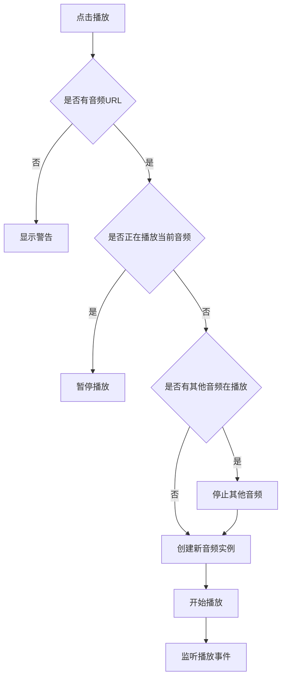

# AudioPlayer 音频播放器组件

## 简介

`AudioPlayer` 是一个完全独立的音频播放器组件，用于播放题目或指导语的音频。所有音频播放逻辑都封装在组件内部，无需依赖父组件提供任何功能。

## 功能特性

- ✅ 完全独立，无需父组件配置
- ✅ 播放/暂停音频控制
- ✅ 播放状态动画效果
- ✅ 自动处理音频 URL（支持相对路径和完整路径）
- ✅ 全局单例模式（同一时间只播放一个音频）
- ✅ 自定义图标样式
- ✅ 自动资源清理

## 使用方式

### 基础用法

```vue
<template>
  <!-- 在题目中使用 -->
  <AudioPlayer :audioUrl="question.audio" />

  <!-- 在指导语中使用 -->
  <AudioPlayer :audioUrl="questionnaireData.audio" />
</template>

<script setup lang="ts">
  import AudioPlayer from './component/AudioPlayer.vue'
</script>
```

### 自定义图标样式

```vue
<template>
  <AudioPlayer :audioUrl="questionnaireData.audio" iconClass="text-2xl text-blue-500" />
</template>
```

## Props

| 参数      | 说明                           | 类型     | 默认值            |
| --------- | ------------------------------ | -------- | ----------------- |
| audioUrl  | 音频 URL（相对路径或完整路径） | `string` | `''`              |
| iconClass | 图标自定义类名                 | `string` | `'text-blue-500'` |

## 核心特性

### 1. 全局单例模式

所有 `AudioPlayer` 组件共享同一个音频实例，确保同一时间只有一个音频在播放：

```typescript
// 使用 Pinia store 实现全局状态共享
const audioStore = useAudioStore()
const { audioInstance, isPlaying, currentAudioUrl } = storeToRefs(audioStore)
```

状态管理文件：`src/store/modules/audio.ts`

### 2. 智能播放控制

- 点击同一个音频图标：暂停当前播放
- 点击不同音频图标：停止当前音频，播放新音频
- 自动处理音频加载失败、播放结束等事件

### 3. 自动资源清理

组件卸载时自动停止音频播放，释放资源：

```typescript
onUnmounted(() => {
  stopAudio()
})
```

## 完整示例

### 在答题页面中使用

```vue
<template>
  <div class="answer-page">
    <!-- 指导语弹窗 -->
    <ElDialog v-model="dialogVisible" title="指导语">
      <div class="description">
        <AudioPlayer :audioUrl="questionnaireData.audio" iconClass="text-2xl text-blue-500" />
        <span v-html="questionnaireData.description"></span>
      </div>
    </ElDialog>

    <!-- 题目列表 -->
    <div class="questions">
      <radioSelect
        v-for="(item, index) in questions"
        :key="index"
        :question="item"
        v-model="item.answer"
      />
    </div>
  </div>
</template>

<script setup lang="ts">
  import AudioPlayer from './component/AudioPlayer.vue'
  import radioSelect from './component/radioSelect.vue'

  // 无需任何音频相关的代码！
  // AudioPlayer 组件会自动处理所有音频播放逻辑
</script>
```

### 在题目组件中使用

```vue
<template>
  <div class="question-box">
    <div class="header">
      <!-- 直接使用，无需任何配置 -->
      <AudioPlayer :audioUrl="question.audio" />
      <div class="title" v-html="question.title"></div>
    </div>

    <div class="options">
      <!-- 选项内容 -->
    </div>
  </div>
</template>

<script setup lang="ts">
  import AudioPlayer from './AudioPlayer.vue'

  interface Props {
    question: any
  }
  const props = defineProps<Props>()
</script>
```

## 样式定制

组件使用 SCSS 编写，支持以下样式定制：

- **图标大小**：`font-size: 24px`
- **悬停缩放**：`transform: scale(1.1)`
- **播放颜色**：`#5D87FF`
- **播放动画**：`pulse` 动画（1.5s 无限循环）

## 工作原理

### 音频 URL 处理

```typescript
const fullAudioUrl = audioUrl.startsWith('http')
  ? audioUrl // 完整路径直接使用
  : `${import.meta.env.VITE_API_PROXY_URL}${audioUrl}` // 相对路径添加前缀
```

### 播放控制流程



## 与旧版本对比

### 旧版本（需要父组件支持）

```vue
<!-- 父组件需要提供音频播放功能 -->
<script setup lang="ts">
  // 需要在父组件中定义
  const audioInstance = ref<HTMLAudioElement | null>(null)
  const isPlaying = ref(false)
  const currentAudioUrl = ref<string>('')

  const playAudio = (audioUrl: string) => {
    /* 复杂逻辑 */
  }
  const stopAudio = () => {
    /* ... */
  }

  // 需要向子组件提供
  provide('playAudio', playAudio)
  provide('isPlaying', isPlaying)
  provide('currentAudioUrl', currentAudioUrl)

  // 需要在卸载时清理
  onUnmounted(() => {
    stopAudio()
  })
</script>

<!-- 子组件需要注入 -->
<script setup lang="ts">
  const playAudio = inject('playAudio')
  const isPlaying = inject('isPlaying')
  const currentAudioUrl = inject('currentAudioUrl')
</script>
```

### 新版本（完全独立）

```vue
<!-- 父组件：无需任何音频相关代码 -->
<template>
  <AudioPlayer :audioUrl="audio" />
</template>

<!-- 子组件：直接使用 -->
<template>
  <AudioPlayer :audioUrl="question.audio" />
</template>
```

## 优势

1. **简化使用**：无需在父组件中配置音频播放功能
2. **代码清晰**：音频逻辑完全封装，职责明确
3. **易于维护**：所有音频相关代码集中在一个组件中
4. **全局管理**：通过 `useState` 实现全局状态管理
5. **自动清理**：组件卸载时自动释放资源

## 注意事项

1. **全局单例**：所有 `AudioPlayer` 组件共享同一个音频实例，同一时间只能播放一个音频。

2. **音频 URL**：支持相对路径和完整路径，相对路径会自动添加 `VITE_API_PROXY_URL` 前缀。

3. **错误处理**：组件内部已处理音频加载失败、播放失败等错误，会自动显示错误提示。

4. **浏览器兼容性**：使用标准的 HTML5 Audio API，需要现代浏览器支持。

## 相关文件

- `AudioPlayer.vue` - 音频播放器组件（所有逻辑都在这里）
- `answer/index.vue` - 答题页面（无需音频相关代码）
- `radioSelect.vue` - 单选题组件（无需音频相关代码）
